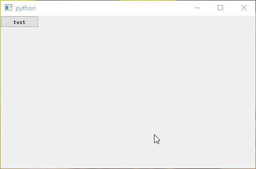
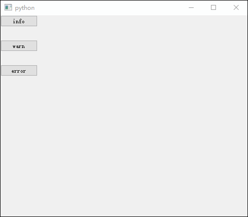
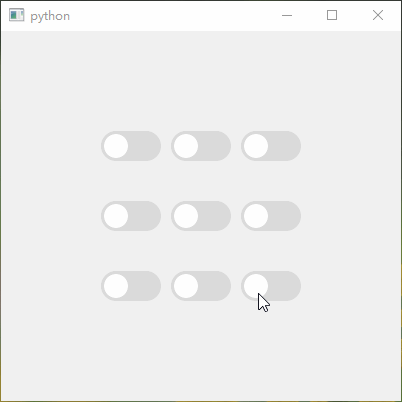
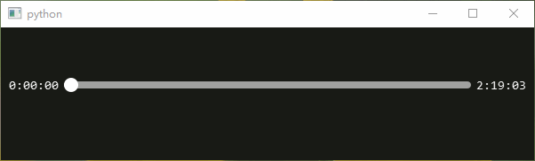
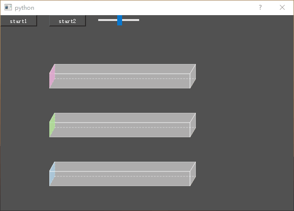

# SomeWidgets
一些小部件

## 安装

```shell
python setup.py install
```

## SProgressDialog

- [案例](test/test_progress_dialog.py)

- 效果图

  

## SMessageBox

- [案例](test/test_message_box.py)

- 效果图

  

## SSwitchButton

- [案例](test/test_switch_button.py)

- 效果图

  
  
## SSMediaSlider

- [案例](test/test_media_slider.py)

- 效果图

  

## SThreeProgress

- [案例](test/test_three_progress.py)

- 效果图

  

